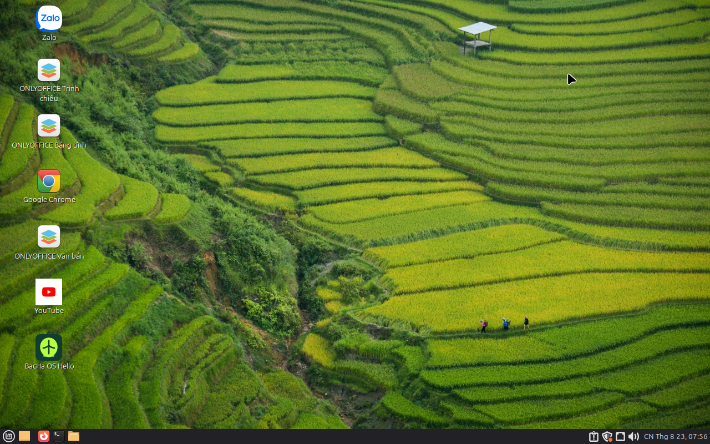
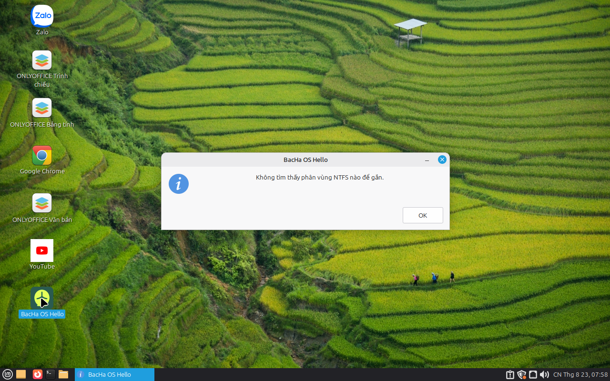

# Bạc Hà OS

**Bản Linux Mint remaster dành cho người dùng Việt Nam — thân thiện, nhẹ và sẵn sàng sử dụng.**

[](https://github.com/starfish367/BacHaOS/actions)

Bạc Hà OS tùy biến Linux Mint với giao diện tiếng Việt, bộ gõ tiếng Việt và các ứng dụng thiết yếu. Dự án hướng đến trải nghiệm dễ dùng cho người mới làm quen Linux, đồng thời vẫn phù hợp với máy tính cấu hình vừa và thấp.

## Website

Trang giới thiệu, liên kết tải ISO, SHA-256, hướng dẫn USB boot, hướng dẫn cài LibreOffice và số liệu cộng đồng công khai có tại **[bachalos-5htcr64s.manus.space](https://bachalos-5htcr64s.manus.space/)**.

## Tính năng

- Tiếng Việt và múi giờ `Asia/Ho_Chi_Minh` mặc định
- Bộ gõ tiếng Việt `fcitx5-unikey`
- Hai phiên bản giao diện: **MATE** nhẹ và **Cinnamon** hiện đại
- OnlyOffice và Google Chrome; launcher OnlyOffice có icon nhận diện rõ ràng
- LibreOffice có thể cài theo yêu cầu qua BacHa OS Hello, không làm nặng ISO mặc định
- BacHa OS Hello tự gắn NTFS qua `ntfs-3g` tại `/mnt/ocung1`, `/mnt/ocung2`… và chỉ đọc khi Windows đang hibernate/Fast Startup
- Lối tắt Zalo Web và YouTube Web
- Hỗ trợ Wine/Bottles cho ứng dụng Windows
- Font Unicode và các tiện ích thiết yếu được chuẩn bị sẵn
- Quy trình build ISO tự động bằng GitHub Actions, có checksum SHA-256 và upload SourceForge

## Ảnh chụp hệ thống

Hai ảnh dưới đây được chụp từ **MATE v0.1.3 sau khi cài đặt**, không phải mockup. Chúng cho thấy desktop, shortcut OnlyOffice và cửa sổ BacHa OS Hello thật. Ảnh MATE/Cinnamon v1.0.0 sẽ chỉ được thêm sau khi boot kiểm chứng thành công trong môi trường đủ tài nguyên.





## Cài LibreOffice khi cần

Từ menu ứng dụng, mở **BacHa OS Hello**, chọn **Cài LibreOffice theo yêu cầu**, rồi xác nhận **Có**. Tiện ích sẽ tải và cài `libreoffice` cùng gói tiếng Việt `libreoffice-l10n-vi`; vì vậy máy cần có Internet trong lúc cài. LibreOffice không có sẵn trong ISO để giảm dung lượng tải xuống, còn OnlyOffice vẫn được cài sẵn.

## Bắt đầu nhanh

### Build bằng GitHub Actions

1. Mở tab **Actions**.
2. Chọn workflow build ISO.
3. Chọn **Run workflow**.
4. Chờ workflow hoàn tất và tải ISO từ artifact hoặc Releases.

### Build thủ công

Build trên máy Linux có quyền `sudo`:

```bash
git clone https://github.com/starfish367/BacHaOS.git
cd BacHaOS
chmod +x scripts/*.sh
sudo ./scripts/build.sh
```

> Build ISO có thể cần nhiều dung lượng đĩa và thời gian. Hãy đọc script trước khi chạy trên máy thật.

## Cấu trúc dự án

```text
scripts/                 # Script build và tùy biến ISO
config/                  # Gói cài đặt, gói loại bỏ và preseed
assets/                  # Icon, shortcut và template
.github/workflows/       # Tự động build ISO
```

Danh sách gói của bản MATE nằm tại [`docs/app-list-mate.md`](docs/app-list-mate.md).

## Đóng góp

Issue và Pull Request luôn được chào đón. Nếu phát hiện lỗi hoặc có ý tưởng cải tiến, hãy mở một Issue và mô tả cách tái hiện rõ ràng.

## Giấy phép

Phát hành theo [GNU GPL-3.0](LICENSE). Bạc Hà OS là một dự án cộng đồng dựa trên Linux Mint.

## Từ khóa

`Linux Mint` · `Bac Ha OS` · `Bạc Hà OS` · `Vietnamese Linux` · `Linux remaster` · `MATE` · `Cinnamon` · `fcitx5-unikey` · `Vietnam`

